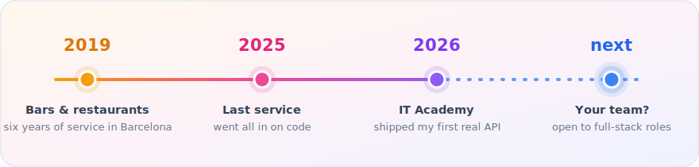

<!-- You read source code before judging. I like you already: kentquinto1@gmail.com -->

# Kent Quinto

**Full-stack developer in Barcelona** · PHP · Laravel · React · MySQL

Hey there! So before all this I spent six years as a waiter and bartender around Barcelona. In 2026 I joined IT Academy and switched to code full time. No regrets!

I speak English, Spanish, Catalan, Tagalog and Ilocano. Yes, all five :)

## 🗺️ How I got here

*From making cocktails to being glued to my laptop..*

## 🧰 Stack

Also in the toolbox: Tailwind, Vite, MongoDB, SQLite, Pest (TDD), Git/GitHub.

## 🚀 Things I've built

**[TCG Manager — API](https://github.com/kentquinto/Sprint5-1)** · `Laravel` `Passport` `MySQL` `Pest`
A Laravel REST API for running trading card game tournaments. Auth with Passport, roles for players and organizers, leaderboards. Built with TDD — 97 tests. The project I'm most proud of so far.

**[TCG Manager — Frontend](https://github.com/kentquinto/Sprint5-2)** · `React` `Vite` `Tailwind` `Docker`
The React app that goes with it. Token auth, role-aware routing, responsive UI, multi-stage Docker build.

<!-- TODO: drop a screenshot or GIF of TCG Manager here — one image of the real app is worth more than everything else on this page.

-->

**[TODO App](https://github.com/aproposito/03-Sprint-03-task)** · `PHP` `MySQL` `MVC` `Gitflow`
A multi-user task manager in raw PHP, no framework. Built it with a team using Gitflow, which honestly taught me as much as the code did.

## 🎯 Right now

- 📚 Finishing the full-stack course at IT Academy (done in October)
- 🔍 Looking for my first full-stack role — Barcelona or remote
- 🛠️ Turning my sprint projects into proper portfolio pieces

## 📬 Contact

If you're hiring (or just want to talk Laravel), say hi:

